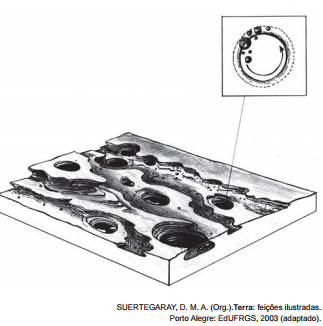

# q

A imagem representa o resultado da erosão que ocorre em rochas nos leitos dos rios, que decorre do processo natural de

# a
fraturamento geológico, derivado da força dos agentes internos.

# b
solapamento de camadas de argilas, transportadas pela correnteza.

# c
movimento circular de seixos e areias, arrastados por águas turbilhonares.

# d
decomposição das camadas sedimentares, resultante da alteração química.

# e
assoreamento no fundo do rio, proporcionado pela chegada de material sedimentar.

# r
c

# s
A figura mostra um fundo de vale com camadas sedimentares sujeitas a formas de erosão circulares, sugerindo a circulação da água de forma turbilhonante. Isso pode ser confirmado pela figura superior direita, que mostra a rotação das partículas que desencadearam o processo.
