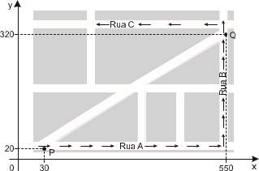
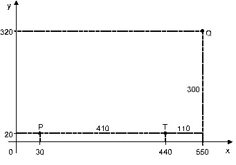

# q
Devido ao aumento do fluxo de passageiros, uma empresa de transporte coletivo urbano está fazendo estudos para a implantação de um novo ponto de parada em uma determinada rota. A figura mostra o percurso, indicado pelas setas, realizado por um ônibus nessa rota e a localização de dois de seus atuais pontos de parada, representados por P e Q.

Os estudos indicam que o novo ponto T deverá ser instalado, nesse percurso, entre as paradas já existentes P e Q, de modo que as distâncias percorridas pelo ônibus entre os pontos P e T e entre os pontos T e Q sejam iguais.

De acordo com os dados, as coordenadas do novo ponto de parada são

# a
(290; 20).

# b
(410;0).

# c
(410; 20).

# d
(440; 0).

# e
(440; 20).

# r
e

# s

Adotando o sistema de coordenadas ortogonais dado, temos P (30; 20) e Q (550; 320).

A distância percorrida pelo ônibus entre as paradas P e Q, pelo percurso indicado no enunciado, é: (550 – 30) + (320 – 20) = 820.

O novo ponto T deve ser instalado nesse percurso e a distância percorrida entre os pontos P e T deve ser igual a $\cfrac{820}{2} = 410$, assim, o ponto T é (30 + 410; 20) = (440; 20)
