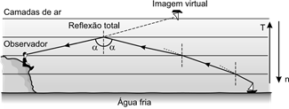

# q
Será que uma miragem ajudou a afundar o Titanic? O fenômeno ótico conhecido como Fata Morgana pode fazer com que uma falsa parede de água apareça sobre o horizonte molhado. Quando as condições são favoráveis, a luz refletida pela água fria pode ser desviada por uma camada incomum de ar quente acima, chegando até o observador, vinda de muitos ângulos diferentes. De acordo com estudos de pesquisadores da Universidade de San Diego, uma Fata Morgana pode ter obscurecido os icebergs da visão da tripulação que estava a bordo do Titanic. Dessa forma, a certa distância, o horizonte verdadeiro fica encoberto por uma névoa escurecida, que se parece muito com águas calmas no escuro.

Disponível em: http://apod.nasa.gov. Acesso em: 6 set. 2012 (adaptado).

O fenômeno ótico que, segundo os pesquisadores, provoca a Fata Morgana é a

# a
ressonância.

# b
refração.

# c
difração.

# d
reflexão.

# e
difusão.

# r
b

# s
O fenômeno citado ocorre depois que a luz sofre sucessivas refrações com subsequente reflexão total. No esquema abaixo, representamos uma situação análoga à proposta

**T = temperatura (aumenta com a altitude)\
n = índice absoluto de refração (diminui com a altitude)**

Na ocorrência da Fata Morgana os fenômenos óticos envolvidos são a refração da luz na atmosfera e a reflexão. Não há como priorizar a importância de um deles, de modo que as opções d e b são possíveis.

A banca examinadora do ENEM optou pela alternativa b.
