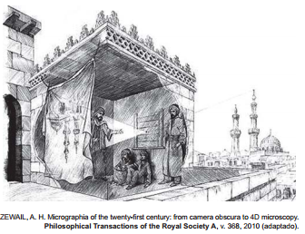
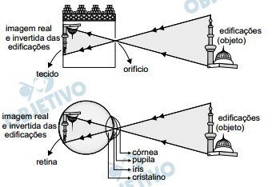

# q
Entre os anos de 1028 e 1038, Alhazen (lbn al-Haytham: 965-1040 d.C.) escreveu sua principal obra, o Livro da Óptica, que, com base em experimentos, explicava o funcionamento da visão e outros aspectos da ótica, por exemplo, o funcionamento da câmara escura. O livro foi traduzido e incorporado aos conhecimentos científicos ocidentais pelos europeus. Na figura, retirada dessa obra, é representada a imagem invertida de edificações em tecido utilizado como anteparo.

Se fizermos uma analogia entre a ilustração e o olho humano, o tecido corresponde ao(à)

# a
íris

# b
retina

# c
pupila

# d
córnea

# e
cristalino

# r
b

# s
As figuras abaixo estabelecem uma analogia entre a câmara escura e o olho humano, em que o tecido corresponde à retina.

