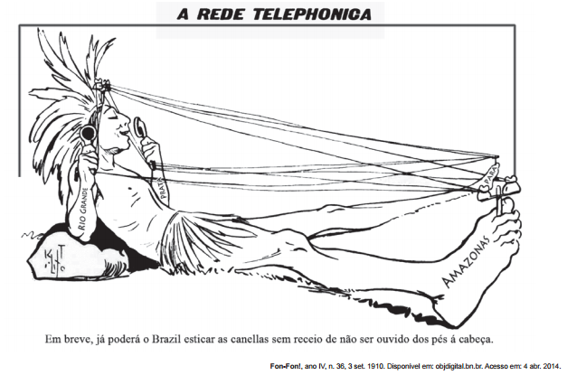

# q

A charge, datada de 1910, ao retratar a implantação da rede telefônica no Brasil, indica que esta

# a
permitiria aos índios se apropriarem da telefonia móvel.

# b
ampliaria o contato entre a diversidade de povos indígenas.

# c
faria a comunicação sem ruídos entre grupos sociais distintos.

# d
restringiria a sua área de atendimento aos estados do norte do país.

# e
possibilitaria a integração das diferentes regiões do território nacional

# r
e

# s
A charge apresenta um índio deitado com as seguintes palavras inscritas no corpo: Rio Grande, Prata, Pará e Amazonas. Isso permite afirmar que a implantação da telefonia no Brasil possibilitaria a integração nacional.
