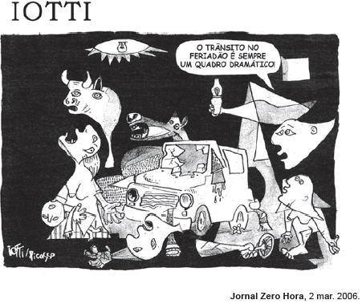

# q

Na criação do texto, o chargista lotti usa criativamente um intertexto: os traços reconstroem uma cena de Guernica, painel de Pablo Picasso que retrata os horrores e a destruição provocados pelo bombardeio a uma pequena cidade da Espanha. Na charge, publicada no período de carnaval, recebe destaque a figura do carro, elemento introduzido por lotti no intertexto. Além dessa figura, a linguagem verbal contribui para estabelecer um diálogo entre a obra de Picasso e a charge, ao explorar

# a
uma referência ao contexto, “trânsito no feriadão”, esclarecendo-se o referente tanto do texto de Iotti quanto da obra de Picasso.

# b
uma referência ao tempo presente, com o emprego da forma verbal “é”, evidenciando-se a atualidade do tema abordado tanto pelo pintor espanhol quanto pelo chargista brasileiro.

# c
um termo pejorativo, “trânsito”, reforçando-se a imagem negativa de mundo caótico presente tanto em Guernica quanto na charge.

# d
uma referência temporal, “sempre”, referindo-se à permanência de tragédias retratadas tanto em Guernica quanto na charge.

# e
uma expressão polissêmica, “quadro dramático”, remetendo-se tanto à obra pictórica quanto ao contexto do trânsito brasileiro.

# r
e

# s
O diálogo entre a obra de Pablo Picasso e a charge se estabelece, primordialmente, por meio da expressão quadro dramático. No contexto da obra (quadro, em sentido literal) do pintor espanhol, há referência ao fato dramático (bombardeamento) vivido pela cidade espanhola. Na charge, essa mesma expressão se relaciona à situação (quadro, em sentido não literal) caótica (dramática) do trânsito brasileiro.
