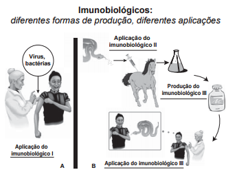

# q

Embora sejam produzidos e utilizados em situações distintas, os imunobiológicos l e II atuam de forma semelhante nos humanos e equinos, pois

# a
conferem imunidade passiva.

# b
transferem células de defesa.

# c
suprimem a resposta imunológica.

# d
estimulam a produção de anticorpos.

# e
desencadeiam a produção de antígenos.

# r
d

# s
Os dois procedimentos mostrados correspondem à introdução de antígenos para estimular a produção de anticorpos específcos nos organismos inoculados.
