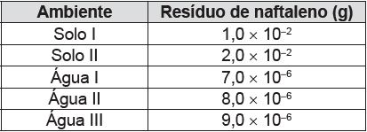

# q
A utilização de processos de biorremediação de resíduos gerados pela combustão incompleta de compostos orgânicos tem se tornado crescente, visando minimizar a poluição ambiental. Para a ocorrência de resíduos de naftaleno, algumas legislações limitam sua concentração em até 30 mg/kg para solo agrícola e 0,14 mg/L para água subterrânea. A quantificação desse resíduo foi realizada em diferentes ambientes, utilizando-se amostras de 500 g de solo e 100 mL de água, conforme apresentado no quadro.

O ambiente que necessita de biorremediação é o(a)

# a
solo I.

# b
solo II

# c
água I.

# d
água II.

# e
água III.

# r
b

# s
Cálculo da máxima quantidade de naftaleno na amostra de solo:

$30 \cdot 10 ^{-3}$g naftaleno -------------------- 1 kg solo\
$m^{máxima}\_{naftaleno}$                -------------------- 0,5 kg solo

$m^{máxima}\_{naftaleno} = 1,5 \cdot 10^{-2}$

Portanto, apenas a amostra de solo II necessita de biorremediação.

Cálculo da máxima quantidade de naftaleno na amostra de água:

$0,14 \cdot 10 ^{-3}$g naftaleno -------------------- 1000 mL água\
$m'^{máxima}\_{naftaleno}$                   -------------------- 100 mL água

$m'^{máxima}\_{naftaleno} = 1,4 \cdot 10^{-5}$g

Nenhuma amostra de água necessita de biorremediação.

Logo, apenas o solo II necessita de biorremediação.

Obs.\
1 mg = $10^{-3}$ g\
1 mL = $10^{-3}$ L
