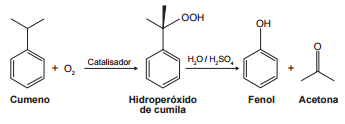

# q
O principal processo industrial utilizado na produção de fenol é a oxidação do cumeno (isopropilbenzeno). A equação mostra que esse processo envolve a formação do hidroperóxido de cumila, que em seguida é decomposto em fenol e acetona, ambos usados na indústria química como precursores de moléculas mais complexas. Após o processo de síntese, esses dois insumos devem ser separados para comercialização individual.

Considerando as características físico-químicas dos dois insumos formados, o método utilizado para a separação da mistura, em escala industrial, é a

# a
filtração.

# b
ventilação.

# c
decantação.

# d
evaporação.

# e
destilação fracionada.

# r
e

# s
Entre as moléculas de fenol, a força intermolecular presente é a ligação de hidrogênio, que é uma interação mais forte do que a interação que ocorre entre as moléculas de acetona (Dipolo-Dipolo). Assim, a temperatura de ebulição do fenol é maior que a da acetona.

Como possuem diferentes temperaturas de ebulição, o método mais apropriado para a separação dessas substâncias é a destilação fracionada.
