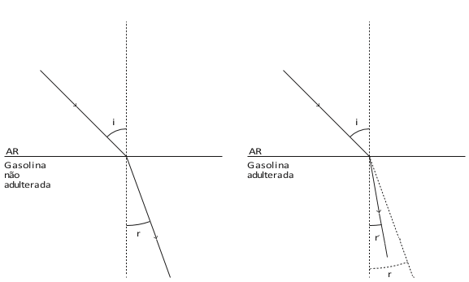

# q
Uma proposta de dispositivo capaz de indicar a qualidade da gasolina vendida em postos e, consequentemente, evitar fraudes, poderia utilizar o conceito de refração luminosa. Nesse sentido, a gasolina não adulterada, na temperatura ambiente, apresenta razão entre os senos dos raios incidente e refratado igual a 1,4. Desse modo, fazendo incidir o feixe de luz proveniente do ar com um ângulo fixo e maior que zero, qualquer modificação no ângulo do feixe refratado indicará adulteração no combustível.

Em uma fiscalização rotineira, o teste apresentou o valor de 1,9. Qual foi o comportamento do raio refratado?

# a
Mudou de sentido.

# b
Sofreu reflexão total.

# c
Atingiu o valor do ângulo limite.

# d
Direcionou-se para a superfície de separação.

# e
Aproximou-se da normal à superfície de separação.

# r
e

# s
De acordo com o enunciado e considerando-se a lei de Snell, tem-se :

\- gasolina não adulterada.

$\cfrac{sen i}{sen r} = \cfrac{n\_{passa}}{n\_{provém}}$

$\cfrac{seni}{senr} = 1,4$           **(1)**\
 

\- gasolina adulterada.

$\cfrac{seni}{senr'} = \cfrac{n'\_{passa}}{n\_{provém}}$

$\cfrac{seni}{senr'} = 1,9$          **(2)**

substituindo **(1)** em **(2) :**

**$senr' \cdot 1,9 = senr \cdot 1,4$**

$\cfrac{senr'}{senr} = \cfrac{1,4}{1,9}$

$senr' = \cfrac{1,4\cdot senr}{1,9}$

$senr' \approx 0,74\\,senr$

assim, $senr' < senr$ e $r' < r$.

Logo, o raio refretado aproximou-se da normal à superficie de separação.

 

 

 
