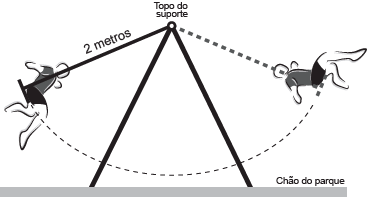
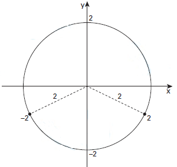

# q
A figura mostra uma criança brincando em um balanço no parque. A corda que prende o assento do balanço ao topo do suporte mede 2 metros. A criança toma cuidado para não sofrer um acidente, então se balança de modo que a corda não chegue a alcançar a posição horizontal.

Na figura, considere o plano cartesiano que contém a trajetória do assento do balanço, no qual a origem está localizada no topo do suporte do balanço, o eixo X é paralelo ao chão do parque, e o eixo Y tem orientação positiva para cima.

A curva determinada pela trajetória do assento do balanço é parte do gráfico da função

# a
$f(x) = - \sqrt{2 - x^2}$

# b
$f(x) = \sqrt{2 - x^2}$

# c
$f(x) = x^2 -2$

# d
$f(x) = - \sqrt{4- x^2}$

# e
$f(x) = \sqrt{4- x^2}$

# r
d

# s
Considerando a origem no topo do suporte do balanço, a trajetória é parte do gráfico de uma circunferência de centro (0,0) e raio 2:

A equação da circunferência é dada por:

$(y-0)^2 + (x-0)^2 = 2^2$

$y^2 + x^2 = 4$

$y^2 = 4 - x^2$

$y = \pm \sqrt{4-x^2}$

Como a curva descrita pelo assento do balanço está abaixo do eixo X, tem-se :

$y = - \sqrt{4-x^2}$ ou $f(x) = - \sqrt{4-x^2}$
