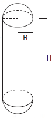

# q
     Uma empresa farmacêutica produz medicamentos em pílulas, cada uma na forma de um cilindro com uma semiesfera com o mesmo raio do cilindro em cada uma de suas extremidades. Essas pílulas são moldadas por uma máquina programada para que os cilindros tenham sempre 10 mm de comprimento, adequando o raio de acordo com o volume desejado.

     Um medicamento é produzido em pílulas com 5 mm de raio. Para facilitar a deglutição, deseja-se produzir esse medicamento diminuindo o raio para 4 mm, e, por consequência, seu volume. Isso exige a reprogramação da máquina que produz essas pílulas.

     Use 3 como valor aproximado para $\pi$.

A redução do volume da pílula, em milímetros cúbicos, após a reprogramação da máquina, será igual a

# a
168\.

# b
304\.

# c
306\.

# d
378\.

# e
514\.

# r
e

# s
As duas semiesferas equivalem a uma esfera de volume $\cfrac{4\pi R^3}{3}$ , sendo R o raio das semiesferas. Já o volume do cilindro é dado por $\pi \cdot R^2 \cdot H$, sendo H a altura do cilindro. Assim, o volume da pílula é dado por:

$V = \cfrac{4\pi R^3}{3} + \pi R^2H$

Veja a figura para facilitar o entendimento :

Com $\pi = 3$ e $H = 5$, temos

Volume da Pílula (**Antes da Redução**) =\
Com R = 4,  $V = \cfrac{4}{3} \cdot 3 \cdot 5^3 + 3 \cdot 5^2\cdot 10 = 1250$

Volume da Pílula (**Após a Redução**) = 

Com R = 5,  $V = \cfrac{4}{3} \cdot 3 \cdot 4^3 + 3 \cdot 4^2\cdot 10 = 736$

A redução será igual a:

1250 - 736 = 514
