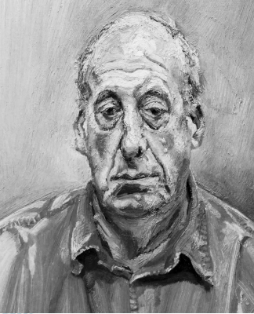

# q
**Texto I**

****

FREUD. L. **Francis Wyndham**. Óleo sobre tela 64x 52 cm. Coleção pessoal. 1993.

 

**Texto II**

     Lucian Freud é, como ele próprio gosta de relembrar às pessoas, um biólogo. Mais propriamente, tem querido registrar verdades muito específicas sobre como é tomar posse deste determinado corpo nesta situação particular, neste específico espaço de tempo.

SMEE, S. **Freud Koin**: Taschen, 2010.

 

Considerando a intencionalidade do artista, mencionada no Texto II, e a ruptura da arte no século XX com o parâmetro acadêmico, a obra apresentada trata do(a)

# a
exaltação da figura masculina

# b
descrição precisa e idealizada da forma.

# c
arranjo simétrico e proporcional dos elementos.

# d
representação do padrão do belo contemporâneo.

# e
fidelidade à forma realista isenta do ideal de perfeição.

# r
e

# s
Conforme a definição que Lucian Freud apresenta de si mesmo, fica evidente a preocupação com a reprodução fiel à verdade, tal como a pintura de Francis Wyndhan.
