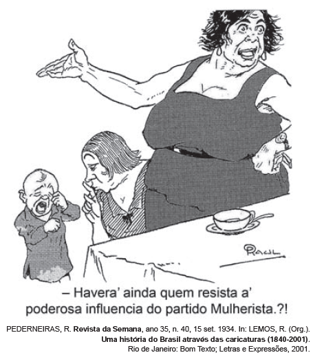

# q

*Na imagem, da década de 1930, há uma crítica à conquista de um direito pelas mulheres, relacionado com a*

# a
*redivisão do trabalho doméstico.*

# b
*liberdade de orientação sexual.*

# c
*garantia da equiparação salarial.*

# d
*aprovação do direito ao divórcio.*

# e
*obtenção da participação eleitoral.*

# r
e

# s
A ascensão de Getúlio Vargas ao poder, após a “Revolução de 30”, marcou o início de um período histórico do Brasil. A Constituição de 1891 foi cancelada. E em 1932 foi outorgado pelo governo provisório um código eleitoral que permitiu às mulheres votarem em 1933; no ano seguinte à Constituição de 1934, entre outras inovações eleitorais, garantiu esse direito. De acordo com a gravura apresentada, a participação feminina na política era, no mínimo, passível de ironia, pois o cotidiano social desse gênero era tradicionalmente restrito, salvo exceções ao ambiente privado da família.
