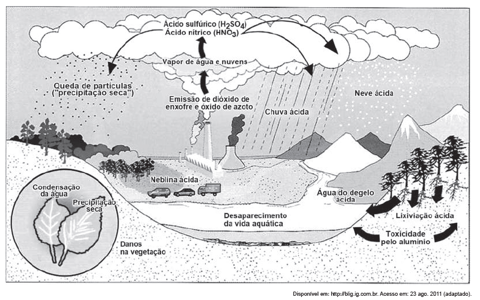

# q

*No esquema, o problema atmosférico relacionado ao ciclo da água acentuou-se após as revoluções industriais. **Uma consequência direta desse problema está na*

# a
*redução da flora.*

# b
*elevação das marés.*

# c
*erosão das encostas.*

# d
*laterização dos solos.*

# e
*fragmentação das rochas.*

# r
a

# s
De acordo com o esquema apresentado, o principal problema relacionado ao ciclo da água após as revoluções industriais é o aumento da sua acidez. Essa elevada acidez compromete a vida animal (fauna) e vegetal (flora), ameaçando até a existência de algumas espécies, sendo essa a principal consequência direta do processo.
