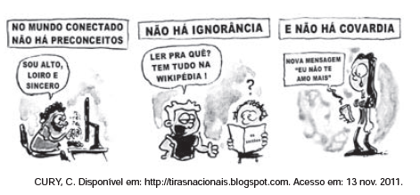

# q

A tirinha denota a postura assumida por seu produtor frente ao uso social da tecnologia para fins de interação e de informação. Tal posicionamento é expresso, de forma argumentativa, por meio de uma atitude

# a
crítica, expressa pelas ironias.

# b
resignada, expressa pelas enumerações.

# c
indignada, expressa pelos discursos diretos.

# d
agressiva, expressa pela contra-argumentação.

# e
alienada, expressa pela negação da realidade.

# r
a

# s
Nas três tirinhas, as falas das personagens estabelecem uma relação de contradição com as frases enunciadas na parte superior dos quadrinhos. No primeiro, por exemplo, o enunciador busca enquadrar-se em certo estereótipo, o que é incompatível com a afirmação de que “no mundo conectado não há preconceitos”. Ocorre, portanto, emprego da **ironia**, figura de linguagem que consiste precisamente em enunciar algo por meio de seu contrário.
