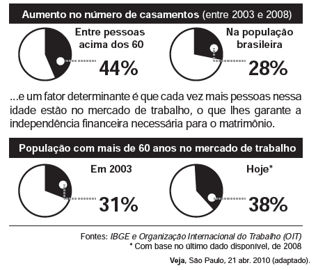

# q
**Casados e independentes**

Um novo levantamento do IBGE mostra que o número de casamentos entre pessoas na faixa dos 60 anos  cresce, desde 2003, a um ritmo 60% maior que o observado na população brasileira como um todo...

Os gráficos expõem dados estatísticos por meio de linguagem verbal e não verbal. No texto, o uso desse recurso

# a
exemplifica o aumento da expectativa de vida da população.

# b
explica o crescimento da confiança na instituição do casamento.

# c
mostra que a população brasileira aumentou nos últimos cinco anos.

# d
indica que as taxas de casamento e emprego cresceram na mesma proporção.

# e
sintetiza o crescente número de casamentos e de ocupação no mercado de trabalho.

# r
e

# s
Os primeiros dois gráficos expõem o percentual de crescimento no número de casamentos entre os brasileiros acima de 60 anos e o percentual de aumento verificado na população em geral, no período 2003-2008. O segundo conjunto mostra o aumento no percentual de brasileiros com mais de 60 anos empregados, revelando um acréscimo de sete pontos percentuais, também no período 2003-2008. Conclui-se, portanto, que os gráficos sintetizam o crescente número de casamentos e do percentual de ocupação no mercado de trabalho da população acima dos 60 anos.

**Observação**:

Vale ressaltar que o texto da alternativa que damos como correta é impreciso, visto que não explicita que o aumento no percentual de ocupação é relativo exclusivamente à faixa etária acima dos 60 anos. Não há dados que permitam generalizar esse dado ao conjunto da população. Um candidato que fizesse uma leitura rigorosa do texto da alternativa poderia dá-la como incorreta em razão da falta de rigor da banca examinadora.
