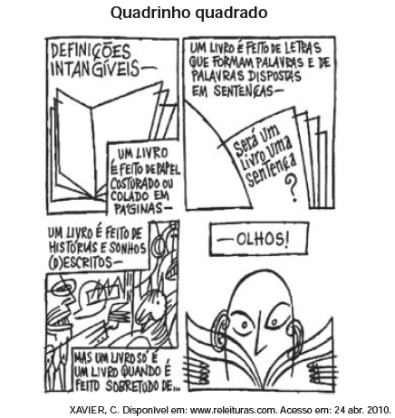

# q

Os objetivos que motivam os seres humanos a estabelecer comunicação determinam, em uma situação de interlocução, o predomínio de uma ou de outra função de linguagem. Nesse texto, predomina a função que se caracteriza por

# a
tentar persuadir o leitor acerca da necessidade de se tomarem certas medidas para a elaboração de um livro.

# b
enfatizar a percepção subjetiva do autor, que projeta para sua obra seus sonhos e histórias.

# c
apontar para o estabelecimento de interlocução de modo superficial e automático, entre o leitor e o livro.

# d
fazer um exercício de reflexão a respeito dos princípios que estruturam a forma e o conteúdo de um livro.

# e
retratar as etapas do processo de produção de um livro, as quais antecedem o contato entre leitor e obra.

# r
c

# s
Os três primeiros quadrinhos exploram as diferentes maneiras de explicar o objeto “livro”, mas sempre sem levar em conta o leitor. O último quadrinho, ao afirmar que o livro é feito de olhos, põe o leitor em destaque na definição do que seja um livro. Implicitamente, é como se dissesse que o livro só existe quando é ativado pela leitura, ou seja, na relação direta com o leitor.
