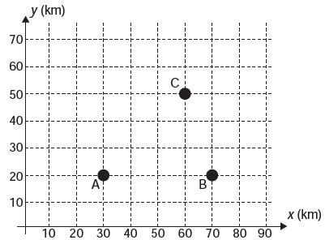
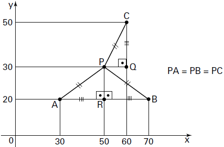

# q
     Nos últimos anos, a televisão tem passado por uma verdadeira revolução, em termos de qualidade de imagem, som e interatividade com o telespectador. Essa transformação se deve à conversão do sinal analógico para o sinal digital. Entretanto, muitas cidades ainda não contam com essa nova tecnologia. Buscando levar esses benefícios a três cidades, uma emissora de televisão pretende construir uma nova torre de transmissão, que envie sinal às antenas A, B e C, já existentes nessas cidades. As localizações das antenas estão representadas no plano cartesiano:

     A torre deve estar situada em um local equidistante das três antenas.

O local adequado para a construção dessa torre corresponde ao ponto de coordenadas

# a
(65 ; 35).

# b
(53 ; 30).

# c
(45 ; 35).

# d
(50 ; 20).

# e
(50 ; 30).

# r
e

# s
No gráfico, o ponto P representa o local da construção da torre:

Como AR = BR = CQ = 20 e PR = PQ = 10, os triângulos retângulos PRA, PRB e PQC são congruentes (caso LAL). Assim, o ponto P possui coordenadas (50 ; 30).
