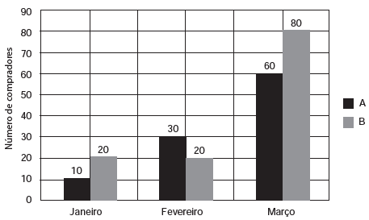

# q
     Uma loja acompanhou o número de compradores de dois produtos, A e B, durante os meses de janeiro, fevereiro e março de 2012. Com isso, obteve este gráfico:

     A loja sorteará um brinde entre os compradores do produto A e outro brinde entre os compradores do produto B.

Qual a probabilidade de que os dois sorteados tenham feito suas compras em fevereiro de 2012?

# a
$\cfrac{1}{20}$

# b
$\cfrac{3}{242}$

# c
$\cfrac{5}{22}$

# d
$\cfrac{6}{25}$

# e
$\cfrac{7}{15}$

# r
a

# s
Imaginando 220 compradores distintos, tem-se:

.   A probabilidade de o comprador sorteado do produto A ter feito sua compra em fevereiro é $\cfrac{30}{10+30+60} = \cfrac{3}{10}$

.   A probabilidade de o comprador sorteado do produto B ter feito sua compra em fevereiro é $\cfrac{20}{20+20+80} = \cfrac{1}{6}$

A probabilidade de os dois sorteados terem feito suas compras em fevereiro de 2012 é:

$\cfrac{3}{10} \cdot \cfrac{1}{6} = \cfrac{1}{20}$

 
