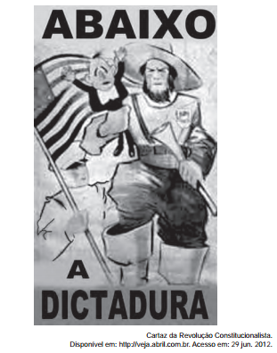

# q

Elaborado pelos partidários da Revolução Constitucionalista de 1932, o cartaz apresentado pretendia mobilizar a população paulista contra o governo federal. Essa mobilização utilizou-se de uma referência histórica, associando o processo revolucionário

# a
à experiência francesa, expressa no chamado à luta contra a ditadura.

# b
aos ideais republicanos, indicados no destaque à bandeira paulista.

# c
ao protagonismo das Forças Armadas, representadas pelo militar que empunha a bandeira.

# d
ao bandeirantismo, símbolo paulista apresentado em primeiro plano.

# e
ao papel figurativo de Vargas na política, enfatizado pela pequenez de sua figura no cartaz.

# r
d

# s
O levante militar de 1932, em São Paulo, organizado pela Frente Única Paulista tinha o propósito de derrubar o Governo Provisório chefiado por Vargas e encerrar a ditadura política através da elaboração de uma nova constituição para o país.

Para alcançar esse objetivo, as elites paulistas usaram uma ampla propaganda com o intuito de promover a mobilização da opinião pública a favor da insurreição. E isso pode ser visualizado no cartaz em destaque, no qual um bandeirante (simbolizando o paulista) esmaga com a mão um anão (na verdade, Getúlio Vargas).
