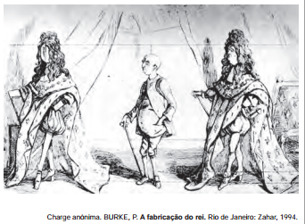

# q

Na França, o rei Luís XIV teve sua imagem fabricada por um conjunto de estratégias que visavam sedimentar uma determinada noção de soberania. Neste sentido, a charge apresentada demonstra

# a
a humanidade do rei, pois retrata um homem comum, sem os adornos próprios à vestimenta real.

# b
a unidade entre o público e o privado, pois a figura do rei com a vestimenta real representa o público e sem a vestimenta real, o privado.

# c
o vínculo entre monarquia e povo, pois leva ao conhecimento do público a figura de um rei despretensioso e distante do poder político.

# d
o gosto estético refinado do rei, pois evidencia a elegância dos trajes reais em relação aos de outros membros da corte.

# e
a importância da vestimenta para a constituição simbólica do rei, pois o corpo político adornado esconde os defeitos do corpo pessoal.

# r
e

# s
A charge ironiza a fabricação da imagem do monarca francês Luís XIV. Os trajes decorados com a flor de lis, os saltos altos, a peruca e o cetro simbolizam o poder, escondem o frágil físico de Luís e o travestem no ‘Rei Sol’, imagem do poder absoluto da monarquia.
