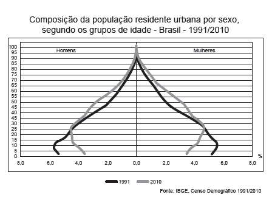
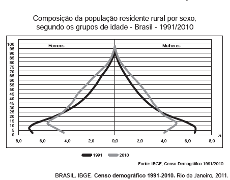

# q

A interpretação e a correlação das figuras sobre a dinâmica demográfica brasileira demonstram um(a)

# a
menor proporção de fecundidade na área urbana.

# b
menor proporção de homens na área rural.

# c
aumento da proporção de fecundidade na área rural.

# d
queda da longevidade na área rural.

# e
queda do número de idosos na área urbana.

# r
a

# s
Nas áreas urbanas, devido, entre outros fatores, ao maior acesso à informação, à disseminação de métodos contraceptivos, à entrada da mulher no mercado de trabalho e ao maior custo de criação do filho, tende a haver uma queda das taxas de natalidade e fecundidade em comparação com as áreas rurais, o que fica nítido com a comparação dos gráficos, que apresentam uma porcentagem de jovens menor na população residente nas cidades.
