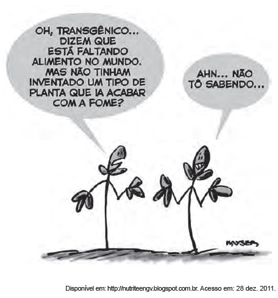

# q

Na charge faz-se referência a uma modificação produtiva ocorrida na agricultura. Uma contradição presente no espaço rural brasileiro derivada dessa modificação produtiva está presente em:

# a
Expansão das terras agricultáveis, com manutenção de desigualdades sociais.

# b
Modernização técnica do território, com redução do nível de emprego formal.

# c
Valorização de atividades de subsistência, com redução da produtividade da terra.

# d
Desenvolvimento de núcleos policultores, com ampliação da concentração fundiária.

# e
Melhora da qualidade dos produtos, com retração na exportação de produtos primários.

# r
a

# s
As transformações que ocorrem no setor agrícola relacionadas com o desenvolvimento tecnológico de produção, como no campo da biotecnologia (transgênicos), embora resultem em expansão das terras agricultáveis e na elevação da produtividade, não contribuem de forma direta para a diminuição das desigualdades sociais.
