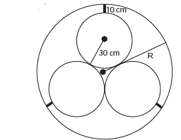
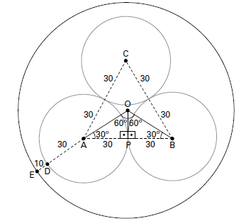

# q
     Em um sistema de dutos, três canos iguais, de raio externo 30 cm, são soldados entre si e colocados dentro de um cano de raio maior, de medida R. Para posteriormente ter fácil manutenção, é necessário haver uma distância de 10 cm entre os canos soldados e o cano de raio maior. Essa distância é garantida por um espaçador de metal, conforme a figura:

Utilize 1,7 como aproximação para $\sqrt{3}$.

O valor de R, em centímetros, é igual a

# a
64,0.

# b
65,5.

# c
74,0.

# d
81,0.

# e
91,0.

# r
c

# s
Do enunciado, tem-se a figura, cotada em cm.

No triângulo OAP, tem-se:

$cos30º = \cfrac{AP}{OA}$

$\cfrac{\sqrt{3}}{2} = \cfrac{30}{OA}$

$OA = 20\sqrt{3}$

Assim, a medida R, em centímetros, é dada por:

R = OA + AD + DE

$R = 20\sqrt{3} + 30 + 10$

$R = 20 \cdot 1,7 + 30 + 10$

$R = 74$
