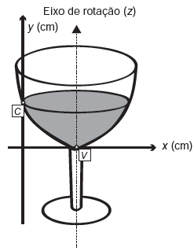

# q
     A parte interior de uma taça foi gerada pela rotação de uma parábola em torno de um eixo z, conforme mostra a figura.

     A função real que expressa a parábola, no plano cartesiano da figura, é dada pela lei $f(x) = \cfrac{3}{2}x^2 - 6x + C$, onde C é a medida da altura do líquido contido na taça, em centímetros. Sabe-se que o ponto V, na figura, representa o vértice da parábola, localizado sobre o eixo x.

Nessas condições, a altura do líquido contido na taça, em centímetros, é

# a
1\.

# b
2\.

# c
4\.

# d
5\.

# e
6\.

# r
e

# s
Sendo $V(X_V + Y_V)$ as coordenadas do ponto V no plano cartesiano da figura, tem-se:

$x_v = -\cfrac{b}{2a}$

$x_v = -\cfrac{(-6)}{2 \cdot (\cfrac{3}{2})}$

$x_v = 2$

Como $y_v = 0$ :

$f(2) = \cfrac{3}{2} \cdot 2^2 - 6 \cdot 2 + C$

$6 - 12 + C =0$

$C = 6$

Logo, a altura do líquido é de 6cm.
