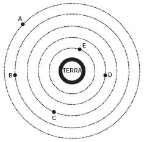
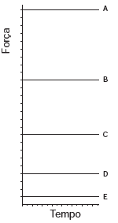
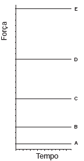
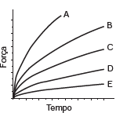
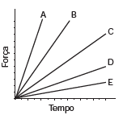
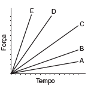
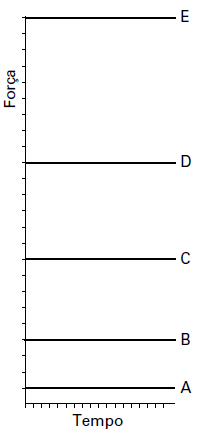

# q
     A Lei da Gravitação Universal, de Isaac Newton, estabelece a intensidade da força de atração entre duas massas. Ela é representada pela expressão:

$F = G\cfrac{m\_1 m\_2}{d^2}$

onde $m\_1$ e $m\_1$ correspondem às massas dos corpos, d à distância entre eles, G à constante universal da gravitação e F à força que um corpo exerce sobre o outro.

     O esquema representa as trajetórias circulares de cinco satélites, de mesma massa, orbitando a Terra.

Qual gráfico expressa as intensidades das forças que a Terra exerce sobre cada satélite em função do tempo?

# a

# b

# c

# d

# e

# r
b

# s
Como os 5 satélites têm a mesma massa, a intensidade F, da força, em cada caso é inversamente proporcional ao quadrado da distância d. Ou seja, quanto maior o valor de d, menor o de F.

Além disso, como as órbitas são circulares, em cada caso, F é constante.

Assim, o gráfico que mais adequadamente representa essa situação é

