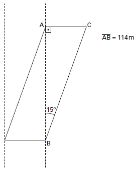

# q
     As torres Puerta de Europa são duas torres inclinadas uma contra a outra, construídas numa avenida de Madri, na Espanha. A inclinação das torres é de 15° com a vertical e elas têm, cada uma, uma altura de 114 m (a altura é indicada na figura como o segmento AB). Estas torres são um bom exemplo de um prisma oblíquo de base quadrada e uma delas pode ser observada na imagem.

Disponível em: www.flickr.com. Acesso em: 27 mar. 2012.

Utilizando 0,26 como valor aproximado para a tangente de 15° e duas casas decimais nas operações, descobre-se que a área da base desse prédio ocupa na avenida um espaço

# a
menor que 100 $m^2$

# b
entre 100 $m^2$ e 300 $m^2$.

# c
entre 300 $m^2$ e 500 $m^2$.

# d
entre 500 $m^2$ e 700 $m^2$.

# e
maior que 700 $m^2$.

# r
e

# s
Supondo que os pontos A e B são vértices opostos do paralelogramo que forma a face lateral destacada, tem-se a figura:

Logo:

 $\cfrac{\overline{AC}}{\overline{AB}} = tg15º$

$\overline{AC} = tg15º \cdot \overline{AB}$

$\overline{AC} = 0,26 \cdot 114$

$\overline{AC} = 29,64\\,m$

Como $\overline{AC}$ é a medida da aresta da base, sua área é:

$A_b = 29,64^2\\, m^2$

$A_b \approx 878,5\\, m^2$

Assim, $A_b$ é maior que $700\\,m^2$.
