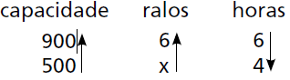

# q
     Uma indústria tem um reservatório de água com capacidade para 900 $m^3$. Quando há necessidade de limpeza do reservatório, toda a água precisa ser escoada. O escoamento da água é feito por seis ralos, e dura 6 horas quando o reservatório está cheio. Esta indústria construirá um novo reservatório, com capacidade de 500 $m^3$, cujo escoamento da água deverá ser realizado em 4 horas, quando o reservatório estiver cheio. Os ralos utilizados no novo reservatório deverão ser idênticos aos do já existente.

A quantidade de ralos do novo reservatório deverá ser igual a

# a
2\.

# b
4\.

# c
5\.

# d
8\.

# e
9\.

# r
c

# s

$\cfrac{6}{x} = \cfrac{900}{500} \cdot \cfrac{4}{6}$

$\cfrac{6}{x} = \cfrac{36}{30}$

$\cfrac{6}{x} = \cfrac{6}{5}$

$x = 5$
