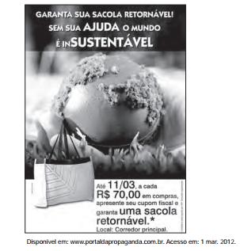

# q

A publicidade, de uma forma geral, alia elementos verbais e imagéticos na constituição de seus textos. Nessa peça publicitária, cujo tema é a sustentabilidade, o autor procura convencer o leitor a

# a
assumir uma atitude reflexiva diante dos fenômenos naturais.

# b
evitar o consumo excessivo de produtos reutilizáveis.

# c
aderir à onda sustentável, evitando o consumo excessivo.

# d
abraçar a campanha, desenvolvendo projetos sustentáveis.

# e
consumir produtos de modo responsável e ecológico

# r
e

# s
Obter a sacola retornável é consumir produtos de modo responsável e ecológico.
