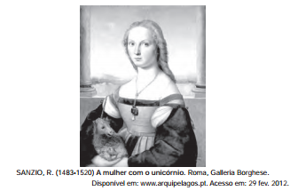

# q
LXXVIII (Camões, 1525?-1580)

Leda serenidade deleitosa,

Que representa em terra um paraíso;

Entre rubis e perlas doce riso;

Debaixo de ouro e neve cor-de-rosa;

Presença moderada e graciosa,

Onde ensinando estão despejo e siso

Que se pode por arte e por aviso,

Como por natureza, ser fermosa;

Fala de quem a morte e a vida pende,

Rara, suave; enfim,

Senhora, vossa;

Repouso nela alegre e comedido:

Estas as armas são com que me rende

E me cativa Amor; mas não que possa

Despojar-me da glória de rendido.

CAMÕES, L. Obra completa. Rio de Janeiro: Nova Aguilar, 2008.

A pintura e o poema, embora sendo produtos de duas linguagens artísticas diferentes, participaram do mesmo contexto social e cultural de produção pelo fato de ambos

# a
apresentarem um retrato realista, evidenciado pelo unicórnio presente na pintura e pelos adjetivos usados no poema.

# b
valorizarem o excesso de enfeites na apresentação pessoal e na variação de atitudes da mulher, evidenciadas pelos adjetivos do poema.

# c
apresentarem um retrato ideal de mulher marcado pela sobriedade e o equilíbrio, evidenciados pela postura, expressão e vestimenta da moça e os adjetivos usados no poema.

# d
desprezarem o conceito medieval da idealização da mulher como base da produção artística, evidenciado pelos adjetivos usados no poema

# e
apresentarem um retrato ideal de mulher marcado pela emotividade e o conflito interior, evidenciados pela expressão da moça e pelos adjetivos do poema.

# r
c

# s
A figura feminina da tela de Rafael apresenta nitida - mente os traços que Camões, no soneto LXXVIII, atribui à mulher, como o semblante sereno, os lábios cor de rubi, o sorriso doce de pérolas, a pele “neve corde-rosa” — em resumo, a representação do paraíso na terra pelo aspecto feminino angelical e portador de beleza incomparável, próxima ao divino.
