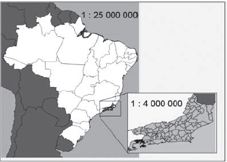

# q
     A figura apresenta dois mapas, em que o estado do Rio de Janeiro é visto em diferentes escalas.

     Há interesse em estimar o número de vezes que foi ampliada a área correspondente a esse estado no mapa do Brasil.

Esse número é

# a
menor que 10.

# b
maior que 10 e menor que 20.

# c
maior que 20 e menor que 30.

# d
maior que 30 e menor que 40.

# e
maior que 40.

# r
d

# s
O número de vezes que foi ampliada a área correspondente ao estado do Rio de Janeiro é dado por:

$(\cfrac{25.000.000}{4.000.000}) = (\cfrac{25}{4})^2 = 39,0625$

ou seja, um número maior que 30 e menor que 40.
