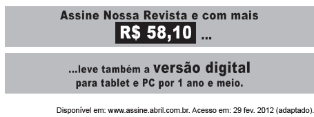

# q

Com o advento da internet, as versões de revistas e livros também se adaptaram às novas tecnologias. A análise do texto publicitário apresentado revela que o surgimento das novas tecnologias

# a
proporcionou mudanças no paradigma de consumo e oferta de revistas e livros.

# b
incentivou a desvalorização das revistas e livros impressos.

# c
viabilizou a aquisição de novos equipamentos digitais.

# d
aqueceu o mercado de venda de computadores.

# e
diminuiu os incentivos à compra de eletrônicos.

# r
a

# s
As novas tecnologias acarretaram novos hábitos de leitura e consumo, pois revistas e livros podem ser comprados em versão digital e lidos em telas de computadores.
