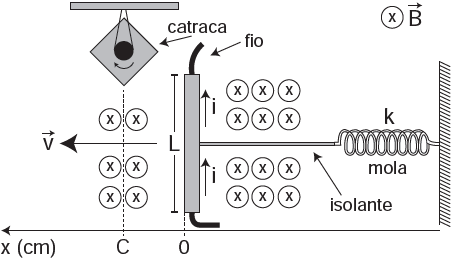

# q
Desenvolve-se um dispositivo para abrir automaticamente uma porta no qual um botão, quando acionado, faz com que uma corrente elétrica i = 6 A percorra uma barra condutora de comprimento L = 5 cm, cujo ponto médio está preso a uma mola de constante elástica $k = 5 \times 10^{-2} $ N/cm. O sistema mola-condutor está imerso em um campo magnético uniforme perpendicular ao plano. Quando acionado o botão, a barra sairá da posição de equilíbrio a uma velocidade média de 5 m/s e atingirá a catraca em 6 milisegundos, abrindo a porta.

A intensidade do campo magnético, para que o dispostivo funcione corretamente, é de

# a
$5 \times 10^{-1}$ T.

# b
$5 \times 10^{-2}$ T.

# c
$5 \times 10^{1}$ T.

# d
$2 \times 10^{-2}$ T.

# e
$2 \times 10^{0}$ T.

# r
a

# s
A questão original não apresenta solução. É provável que a banca examinadora espere a seguinte consideração: “no instante em que a barra atinge a catraca, a força magnética equilibra a força elástica”. Nessa circunstância, a solução seria:

$F\_{mag} = F\_{elast}$

$B \cdot i \cdot l = k \cdot x$, em que : $x = v \cdot \Delta t$

$B \cdot 6 \cdot 5 \cdot 10^{-2} = 5 \cdot 5 \cdot 6 \cdot 10^{-3}$

$B = 5 \cdot 10^{-1} \\, T$
