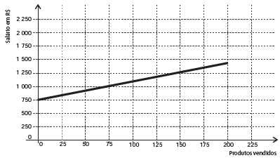
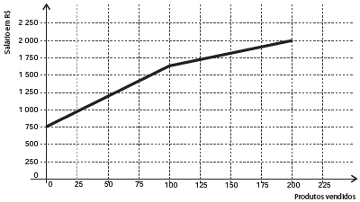
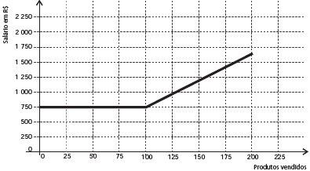
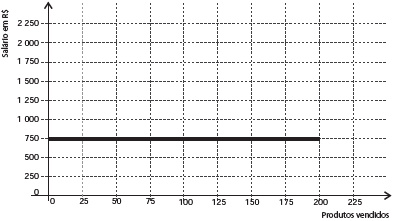
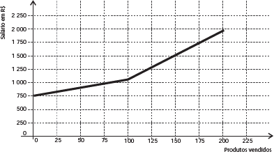
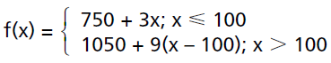
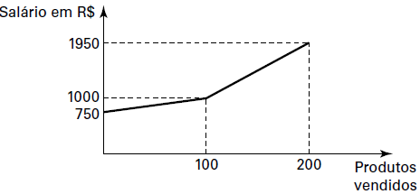

# q
     Certo vendedor tem seu salário mensal calculado da seguinte maneira: ele ganha um valor fixo de R$ 750,00, mais uma comissão de R$ 3,00 para cada produto vendido. Caso ele venda mais de 100 produtos, sua comissão passa a ser de R$ 9,00 para cada produto vendido, a partir do 101º produto vendido.

Com essas informações, o gráfico que melhor representa a relação entre salário e o número de produtos vendidos é

 

# a

# b

# c

# d

# e

# r
e

# s
Seja x a quantidade de produtos vendidos, e f(x) a função que designa o salário que ele receberá pela quantidade de produtos, assim:

• para $x \leq 100$, ele receberá 750 mais 3x;\
• para $x > 100$, ele receberá 750 + 300 = 1050 mais 9(x – 100).

Então:

Representando graficamente:

