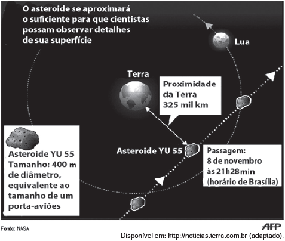

# q
     A Agência Espacial Norte Americana (NASA) informou que o asteroide YU 55 cruzou o espaço entre a Terra e a Lua no mês de novembro de 2011. A ilustração a seguir sugere que o asteroide percorreu sua trajetória no mesmo plano que contém a órbita descrita pela Lua em torno da Terra. Na figura, está indicada a proximidade do asteroide em relação à Terra, ou seja, a menor distância que ele passou da superfície terrestre.

Com base nessas informações, a menor distância que o asteroide YU 55 passou da superfície da Terra é igual a

# a
$3,25 \times 10^2$ km.

# b
$3,25 \times 10^3$ km.

# c
$3,25 \times 10^4$ km.

# d
$3,25 \times 10^5$ km.

# e
$3,25 \times 10^6$ km.

# r
d

# s
Do enunciado, temos que a distância pedida é de 325 mil km, ou seja, $3,25 \times 10^5$ km
