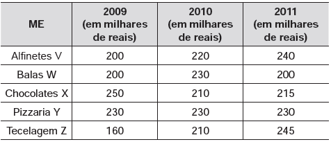

# q
     A tabela a seguir mostra a evolução da receita bruta anual nos três últimos anos de cinco microempresas (ME) que se encontram à venda.

Um investidor deseja comprar duas das empresas listadas na tabela. Para tal, ele calcula a média da receita bruta anual dos últimos três anos (de 2009 até 2011) e escolhe as duas empresas de maior média anual.

As empresas que este investidor escolhe comprar são

# a
Balas W e Pizzaria Y.

# b
Chocolates X e Tecelagem Z.

# c
Pizzaria Y e Alfinetes V.

# d
Pizzaria Y e Chocolates X.

# e
Tecelagem Z e Alfinetes V.

# r
d

# s
Calculemos todas as médias:

$m\_{alfinetes\\,V} = \cfrac{200+220+240}{3} = 220$

$m\_{balas\\,W} = \cfrac{200+230+200}{3} = 210$

$m\_{chocolates\\,X} = \cfrac{250+210+215}{3} = 225$

$m\_{pizzaria\\,Y} = \cfrac{230+230+230}{3} = 230$

$m\_{Tecelagem\\,Z} = \cfrac{160+210+245}{3} = 205$

Assim, as empresas que o investidor escolhe comprar são: Pizzaria Y e Chocolates X
