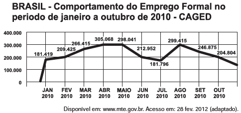

# q
     O gráfico apresenta o comportamento de emprego formal surgido, segundo o Caged, no período de janeiro de 2010 a outubro de 2010.

Com base no gráfico, o valor da parte inteira da mediana dos empregos formais surgidos no período é

# a
212 952.

# b
229 913.

# c
240 621.

# d
255 496.

# e
298 041.

# r
b

# s
Colocando os valores do rol em ordem crescente, temos:

181.419, 181.796, 204.804, 209.425, 212.952, 246.875, 266.415, 298.041, 299.415, 305.068.

A mediana é a média entre o 5º e o 6º termos. Assim:

$Mediana = \cfrac{212.952 + 246.875}{2} = 229.913,5$

A parte inteira é 229.913.
