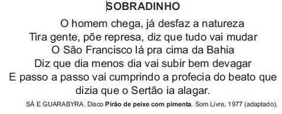

# q

O trecho da música faz referência a uma importante obra na região do rio São Francisco. Uma consequência socioespacial dessa construção foi

# a
a migração forçada da população ribeirinha.

# b
o rebaixamento do nível do lençol freático local.

# c
a preservação da memória histórica da região.

# d
a ampliação das áreas de clima árido.

# e
a redução das áreas de agricultura irrigada.

# r
a

# s
A letra da música apresentada explora aspectos relacionados à construção da represa de Sobradinho (região Nordeste) no rio São Francisco. Para a realização dessa obra (década de 1970) uma parcela da população ribeirinha residente no local teve de ser desalojada e transferida para núcleos próximos, o que gerou sérios problemas sociais.
