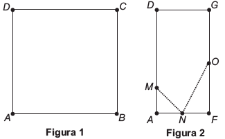
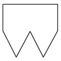
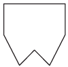
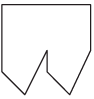
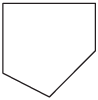
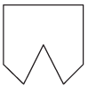
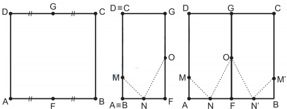

# q
Uma família fez uma festa de aniversário e enfeitou o local da festa com bandeirinhas de papel. Essas bandeirinhas foram feitas da seguinte maneira: inicialmente, recortaram as folhas de papel em forma de quadrado, como mostra a Figura 1. Em seguida, dobraram as folhas quadradas ao meio sobrepondo os lados BC e AD, de modo que C e D coincidam, e o mesmo ocorra com A e B, conforme ilustrado na Figura 2. Marcaram os pontos médios O e N, dos lados FG e AF, respectivamente, e o ponto M do lado AD, de modo que AM seja igual a um quarto de AD. A seguir, fizeram cortes sobre as linhas pontilhadas ao longo da folha dobrada.

 

 

Após os cortes, a folha é aberta e a bandeirinha está pronta.

A figura que representa a forma da bandeirinha pronta é

# a

# b

# c

# d

# e

# r
e

# s

 

 
