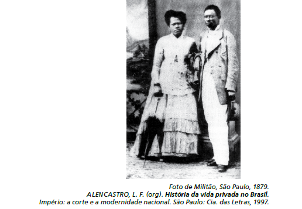

# q

Que aspecto histórico da escravidão no Brasil do séc. XIX pode ser identificado a partir da análise do vestuário do casal retratado?

# a
O uso de trajes simples indica a rápida incorporação dos ex-escravos ao mundo do trabalho urbano.

# b
A presença de acessórios como chapéu e sombrinha aponta para a manutenção de elementos culturais de origem africana.

# c
O uso de sapatos é um importante elemento de diferenciação social entre negros libertos ou em melhores condições na ordem escravocrata.

# d
A utilização do paletó e do vestido demonstra a tentativa de assimilação de um estilo europeu como forma de distinção em relação aos brasileiros.

# e
A adoção de roupas próprias para o trabalho doméstico tinha como finalidade demarcar as fronteiras da exclusão social naquele contexto.

# r
c

# s
Durante todo o período da existência do sistema escravista brasileiro, os cativos eram obrigados a andar descalços. Por isso os negros forros procuravam usar as vestimentas e os sapatos que caracterizavam o homem livre, tratava-se, portanto, de importantes elementos de diferenciação social.
