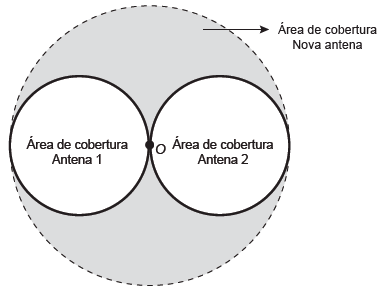

# q
Uma empresa de telefonia celular possui duas antenas que serão substituídas por uma nova, mais potente. As áreas de cobertura das antenas que serão substituídas são círculos de raio 2 km, cujas circunferências se tangenciam no ponto O, como mostra a figura.

O ponto O indica a posição da nova antena, e sua região de cobertura será um círculo cuja circunferência tangenciará externamente as circunferências das áreas de cobertura menores.

Com a instalação da nova antena, a medida da área de cobertura, em quilômetros quadrados, foi ampliada em

# a
$8\pi$

# b
$12\pi$

# c
$16\pi$

# d
$32\pi$

# e
$64\pi$

# r
a

# s
Todas as áreas calculadas a seguir estão em quilômetros quadrados.

A área coberta pelas antenas antigas era:

$S_A = 2\pi \cdot 2^2 = 8\pi$

A área coberta pela nova antena é:

$S_N = \pi \cdot 4^2 = 16\pi$

A área de cobertura foi ampliada em $16\pi - 8\pi = 8\pi$
