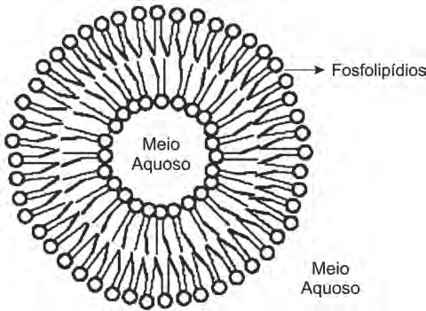
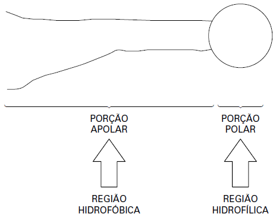

# q
     Quando colocados em água, os fosfolipídeos tendem a formar lipossomos, estruturas formadas por uma bicamada lipídica, conforme mostrado na figura. Quando rompida, essa estrutura tende a se reorganizar em um novo lipossomo.

Disponível em: http://course1.winona.edu. Acesso em: 1 mar. 2012 (adaptado).

Esse arranjo característico se deve ao fato de os fosfolipídios apresentarem uma natureza

# a
polar, ou seja, serem inteiramente solúveis em água.

# b
apolar, ou seja, não serem solúveis em solução aquosa.

# c
anfotérica, ou seja, podem comportar-se como ácidos e bases.

# d
insaturada, ou seja, possuírem duplas ligações em sua estrutura.

# e
anfifílica, ou seja, possuírem uma parte hidrofílica e outra hidrofóbica.

# r
e

# s
Os fosfolipídios apresentam uma porção polar e outra apolar, conforme representação esquemática a seguir:

Essas características da estrutura do fosfolipídio lhe conferem uma natureza anfifílica e justifi cam o arranjo estrutural do lipossomo.
