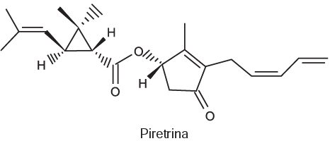
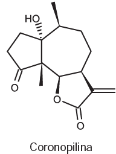
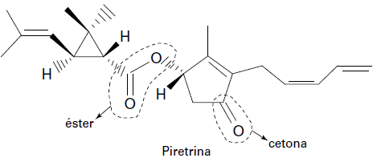
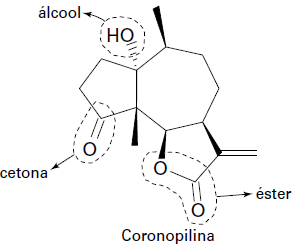

# q
     A produção mundial de alimentos poderia se reduzir a 40% da atual sem a aplicação de controle sobre as pragas agrícolas. Por outro lado, o uso frequente dos agrotóxicos pode causar contaminação em solos, águas superficiais e subterrâneas, atmosfera e alimentos. Os biopesticidas, tais como a piretrina e a coronopilina, têm sido uma alternativa na diminuição dos prejuízos econômicos, sociais e ambientais gerados pelos agrotóxicos.

Identifique as funções orgânicas presentes simultaneamente nas estruturas dos dois biopesticidas apresentados:

 

# a
Éter e éster.

# b
Cetona e éster.

# c
Álcool e cetona.

# d
Aldeído e cetona.

# e
Éter e ácido carboxílico.

# r
b

# s
As funções orgânicas presentes nas estruturas são:

As funções orgânicas presentes simultaneamente nas estruturas são: cetona e éster.
