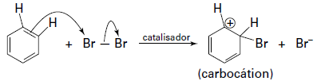

# q
     O benzeno é um hidrocarboneto aromático presente no petróleo, no carvão e em condensados de gás natural. Seus metabólitos são altamente tóxicos e se depositam na medula óssea e nos tecidos gordurosos. O limite de exposição pode causar anemia, câncer (leucemia) e distúrbios do comportamento. Em termos de reatividade química, quando um eletrófilo se liga ao benzeno, ocorre a formação de um intermediário, o carbocátion. Por fim, ocorre a adição ou substituição eletrofílica.

Disponível em: www.sindipetro.org.br. Acesso em: 1 mar. 2012 (adaptado).

Disponível em: www.qmc.ufsc.br. Acesso em: 1 mar. 2012 (adaptado).

Com base no texto e no gráfico do progresso da reação apresentada, as estruturas químicas encontradas em I, II e III são, respectivamente:

# a

# b

# c

# d

# e

# r
a

# s
A reação que leva à formação do carbocátion é:

Carbocátion é uma espécie de íon em que átomos de carbono adquirem carga positiva e podem ser formados em diversas reações orgânicas. Esse intermédiário pode sofrer reação de adição ou substituição como representado:

O produto da substituição é o III, de menor energia, pois possui um anel aromático em sua estrutura que, por ressonância, torna-o mais estável.
