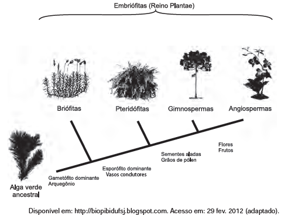

# q
     A imagem representa o processo de evolução das plantas e algumas de suas estruturas. Para o sucesso desse processo, a partir de um ancestral simples, os diferentes grupos vegetais desenvolveram estruturas adaptativas que lhes permitiram sobreviver em diferentes ambientes.

Qual das estruturas adaptativas apresentadas contribuiu para uma maior diversidade genética?

# a
As sementes aladas, que favorecem a dispersão aérea.

# b
Os arquegônios, que protegem o embrião multicelular.

# c
Os grãos de pólen, que garantem a polinização cruzada.

# d
Os frutos, que promovem uma maior eficiência reprodutiva.

# e
Os vasos condutores, que possibilitam o transporte da seiva bruta.

# r
c

# s
Das estruturas adaptativas representadas no esquema, os grãos de pólen, ao garantirem a polinização cruzada, propiciam uma maior diversidade genética.

**Observação:** A posição da cota “Gametófito dominante e arquegônio”, no esquema, sugere que em todos os grupos situados à sua direita essas características estão presentes, o que não corresponde à realidade. O mesmo pode ser dito quanto à cota “Sementes aladas”, característica que não está presente em todas as Angiospermas.

Note-se, ainda, que há uma redação de cunho finalista (lamarckista), no trecho: “Para o sucesso desse processo, a partir de um ancestral simples (…) os diferentes vegetais desenvolveram estruturas adaptativas...”.
