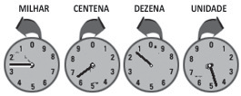

# q
O medidor de energia elétrica de uma residência, conhecido por “relógio de luz”, é constituído de quatro pequenos relógios, cujos sentidos de rotação estão indicados conforme a figura:

Disponível em: http://www.enersul.com.br. Acesso em: 26 abr. 2010.

A medida é expressa em kWh. O número obtido na leitura é composto por 4 algarismos. Cada posição do número é formada pelo último algarismo ultrapassado pelo ponteiro.

O número obtido pela leitura em kWh, na imagem, é

# a
2 614.

# b
3 624.

# c
2 715.

# d
3 725.

# e
4 162.

# r
a

# s
A partir da observação do “relógio de luz” temos a seguinte leitura:

• milhar: 2\
• centena: 6\
• dezena: 1\
• unidade: 4

Assim, o número, em kWh, obtido na imagem é 2 614.
