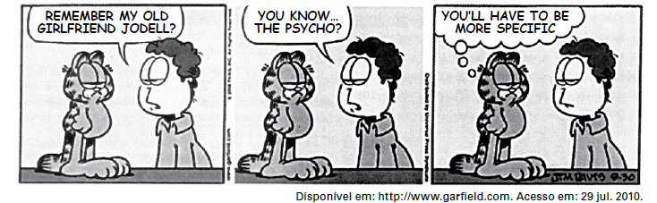

# q

A tira, definida como um segmento de história em quadrinhos, pode transmitir uma mensagem com efeito de humor. A presença desse efeito no diálogo entre Jon e Garfield acontece porque

# a
Jon pensa que sua ex-namorada é maluca e que Garfield não sabia disso.

# b
Jodell é a única namorada maluca que Jon teve, e Garfield acha isso estranho.

# c
Garfield tem certeza de que a ex-namorada de Jon é sensata, o maluco é o amigo.

# d
Garfield conhece as ex-namoradas de Jon e considera mais de uma como maluca.

# e
Jon caracteriza a ex-namorada como maluca e não entende a cara de Garfield.

# r
d

# s
Jon pergunta a Garfield se ele se lembra de sua ex-namorada Jodell e acrescenta: “aquela louca”. Garfield, então, responde: “Você terá que ser mais específico.”
