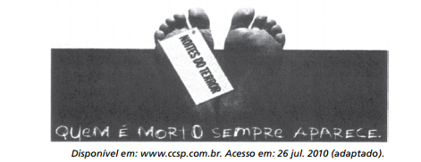

# q

O anúncio publicitário está intimamente ligado ao ideário de consumo quando sua função é vender um produto. No texto apresentado, utilizam-se elementos linguísticos e extralinguísticos para divulgar a atração “Noites do Terror”, de um parque de diversões. O entendimento da propaganda requer do leitor

# a
a identificação com o público-alvo a que se destina o anúncio.

# b
a avaliação da imagem como uma sátira às atrações de terror.

# c
a atenção para a imagem da parte do corpo humano selecionada aleatoriamente

# d
o reconhecimento do intertexto entre a publicidade e um dito popular.

# e
a percepção do sentido literal da expressão “noites do terror”, equivalente à expressão “noites de terror”.

# r
d

# s
O propósito de vender o produto anunciado faz com que as peças publicitárias explorem recursos que tornem o texto mais expressivo. Na frase em destaque no anúncio (“Quem é morto sempre aparece”), esse recurso é a relação intertextual com o conhecido ditado popular que afirma “Quem é vivo sempre aparece”. A plena compreensão da mensagem, portanto, depende de se reconhecer essa intertextualidade.
