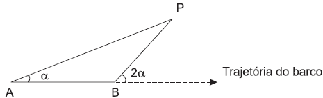
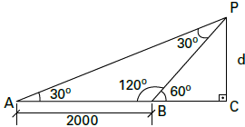

# q
Para determinar a distância de um barco até a praia, um navegante utilizou o seguinte procedimento: a partir de um ponto A, mediu o ângulo visual a fazendo mira em um ponto fixo P da praia. Mantendo o barco no mesmo sentido, ele seguiu até um ponto B de modo que fosse possível ver o mesmo ponto P da praia, no entanto sob um ângulo visual $2 \alpha$. A figura ilustra essa situação:

Suponha que o navegante tenha medido o ângulo $\alpha = 30º$ e, ao chegar ao ponto B, verificou que o barco havia percorrido a distância AB = 2 000 m. Com base nesses dados e mantendo a mesma trajetória, a menor distância do barco até o ponto fixo P será

# a
1 000 m.

# b
$1000\sqrt{3}$ m.

# c
$2000 \cfrac{\sqrt{3}}{3}$m.

# d
2000 m.

# e
$2000\sqrt{3}$ m.

# r
b

# s

ΔAPB:

$Â ≡ Pˆ $

AB = BP = 2 000

ΔBPC:

$sen 60º = \cfrac{PC}{BP}$

$\cfrac{\sqrt{3}}{2} = \cfrac{d}{2000}$

$d = 1000 \sqrt{3}$
